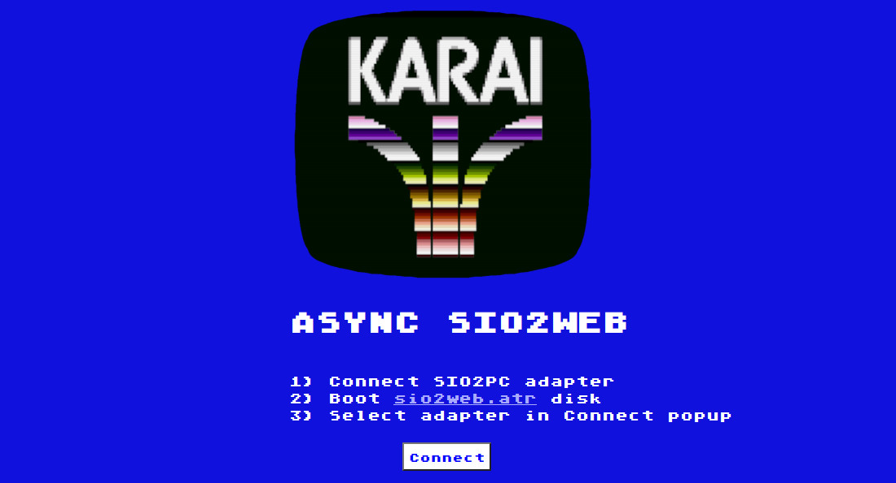

# KARAI

 

Karai (辛い) is a Japanese Go term meaning 'to be shrewd with resources'
- Develop using modern 8-bit emulators, deploy to vintage 8-bit targets
- Create and distribute legit Atari floppy disk apps that can leverage modern resources
- Popular components (Git, bash, Atari BASIC, Altirra, AspeQT, etc)
- Produces Atari bootable floppy disk apps (ATR files)
- Requires only an inexpensive SIO2PC adapter (UART-USB cable)

   
  

  

# Example Projects

 

## Atari VT

https://github.com/dcerisano/karai/assets/1641613/40735183-96d6-4266-9446-c660215d1964

  

## SIO2WEB (WebSIO)

  

